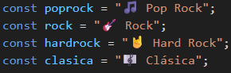
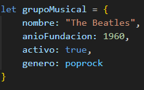
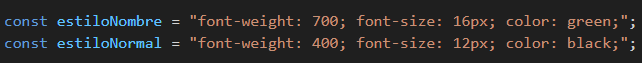
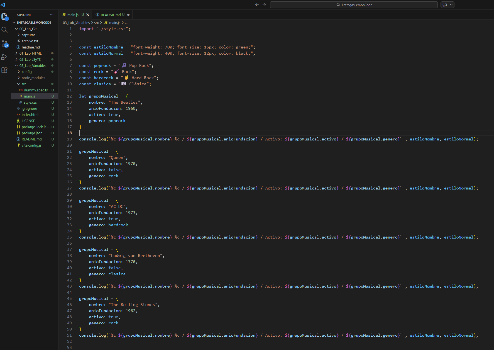
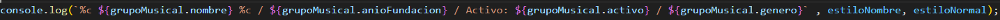
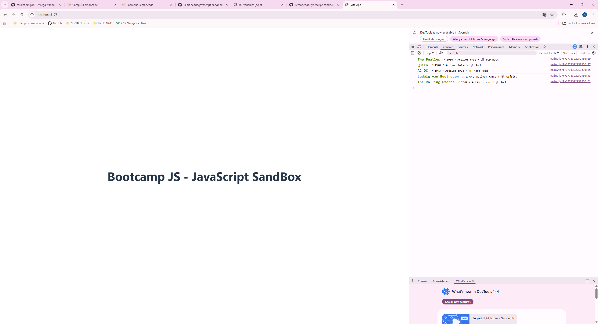

# Entrega Variables

# Paso 1: Crear las variables (const, ya que no van a cambiar) de los géneros musicales

# Paso 2: Crear el objeto "grupoMusical" que tendrá toda la información de los grupos musicales (usamos let, ya que vamos a cambiar el objeto varias veces, aunque también se podría acceder a los atributos del objeto mediante "grupoMusical.nombre = X" con const.), como podemos ver, usamos el const de cada genero creados en la captura anterior.

# Paso 3: He creado un estilo para el nombre y un estilo base, ya que quiero mostrar todos los datos en un mismo console.log, por lo que también usaré dos "%c"

# Este es el código entero después de cambiar y mostrar la variable "grupoMusical" las veces necesarias:

# El resultado en la consola se vería así:

